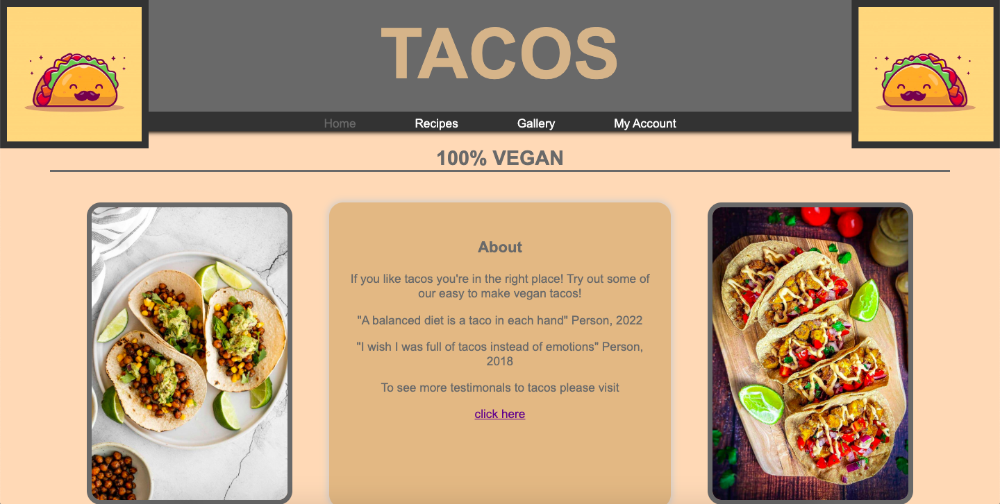
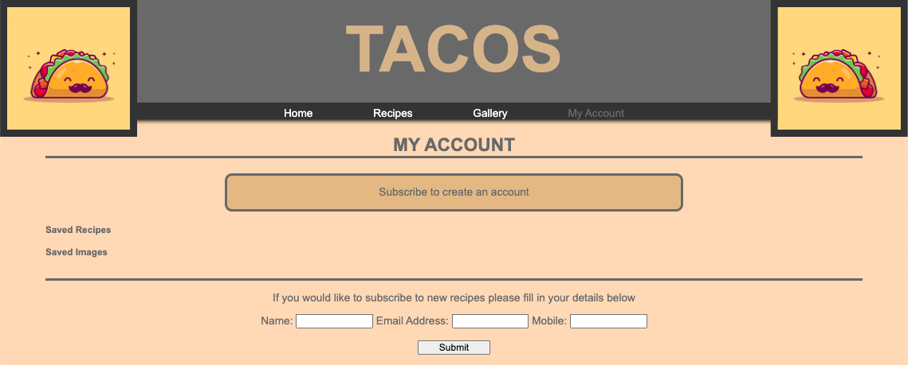
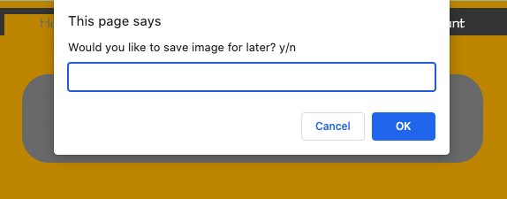
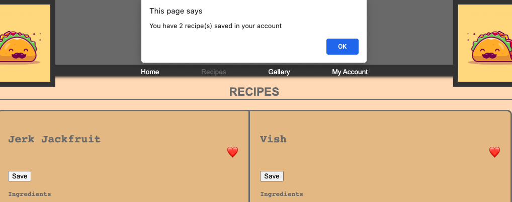
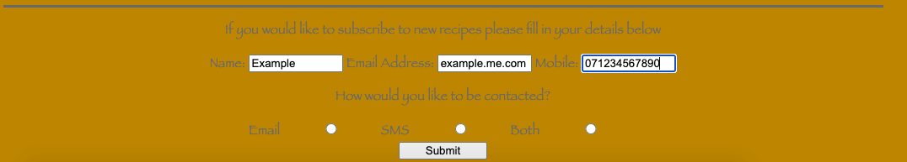
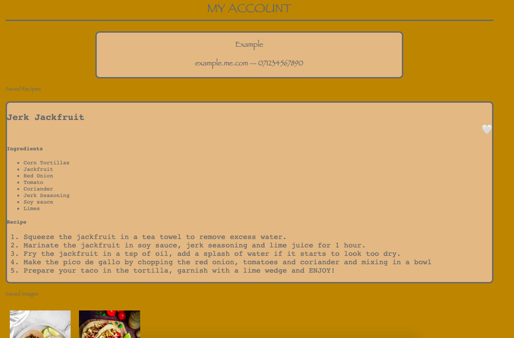

# Capstone Project - Build a Complete Website
While studying in my Web Development Bootcamp I was given the task to build a complete working website using Javascript, HTML and CSS. I was given the freedom to make it about any subject. I chose to create a recipe website for Tacos. I feel this was the kind of website I could make to utilise all the different skills I have gained throughout the bootcamp. There were certain specifications I had to follow; The style had to include various different fonts and styles using CSS. I had to include a table and lists, links, images and forms. 
After creating the base website without any functionality I was given the task to use JavaScript to create a "save for later" page. Using the session storage images/recipes/articles had to be able to be saved onto another page to be viewed later. I made this a "My account" page where the user can subscribe and save the contents over to a new HTML. 

1. [Installation](#install)
2. [Usage](#usage)
3. [Credits](#credits)

## Installation
* Create a folder on your local drive
* Get to the directory in your terminal using cd
* Initialise the respository in your directory $ git init
* Clone the remote repository $ git clone https://github.com/SamBaldwin4566/finalCapstone
* Open the index.html page as the opening page

## Usage
When you open index.html it will take you to the websites home page.  
  

Use the Navigation Bar at the top to take you to the different webpages. My Account is will at first be empty ready to be populated with details of the user, images and recipes using session storage.  
  

When you click an image a prompt box will appear asking if you would like to save the image for later and then let you know how many images/recipes you have saved to your account  
|  

The form at the bottom of the page allows you to 'subscirbe' and create an account.  
  

All the details/recipes/images saved will populate My Account.  
  

## Credits
This was a individual project by Sam Baldwin